## Overview

Evalutating MIC to the Datasaurus Dozen data set using minerva package in R.
**Same Stats, Different Graphs: Generating Datasets with Varied Appearance and Identical Statistics through Simulated Annealing". [ACM SIGCHI Conference on Human Factors in Computing Systems](https://www.autodeskresearch.com/publications/samestats)**

## Examples
### Data preparation

```r
require(minerva)
require(tidyverse)
require(magrittr)

dists.df <- read.delim(file = "src/DatasaurusDozen.tsv", sep = "\t", header = TRUE)
```
### View

```r
dn <- unique((dists.df$dataset))
for(i in 1:length(dn)){
  dists.df %>% filter(dataset==dn[i]) %$% plot(x=x, y=y, main=dn[i])
}
```

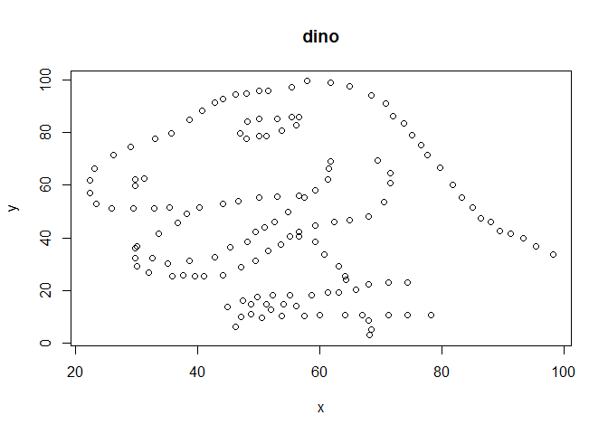<!-- -->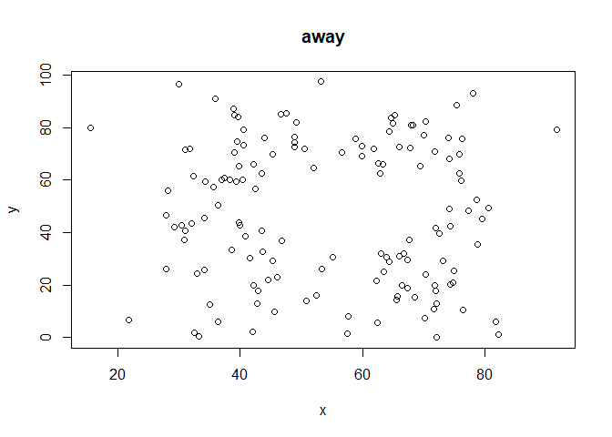<!-- -->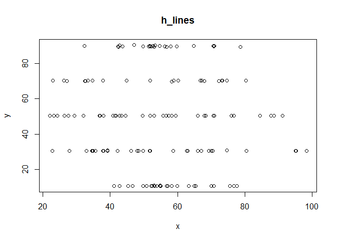<!-- -->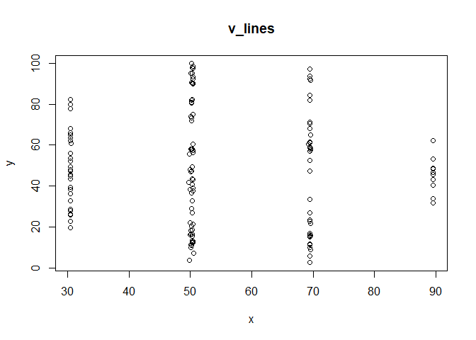<!-- -->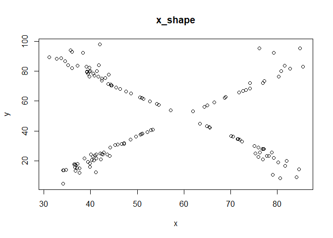<!-- -->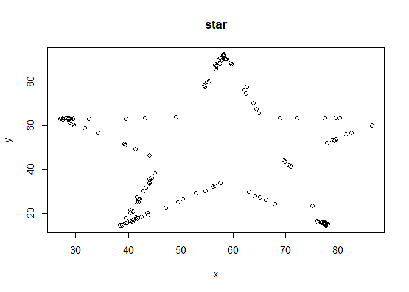<!-- -->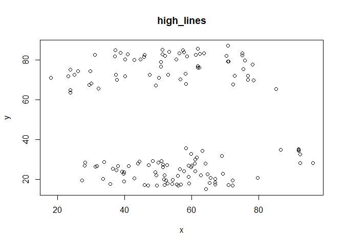<!-- -->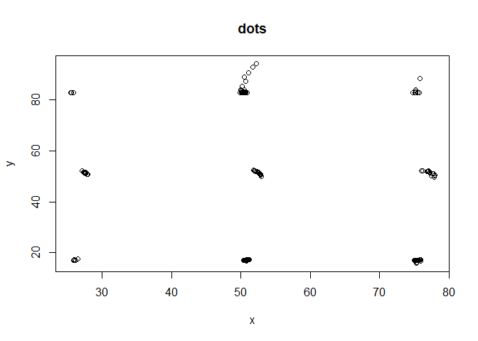<!-- -->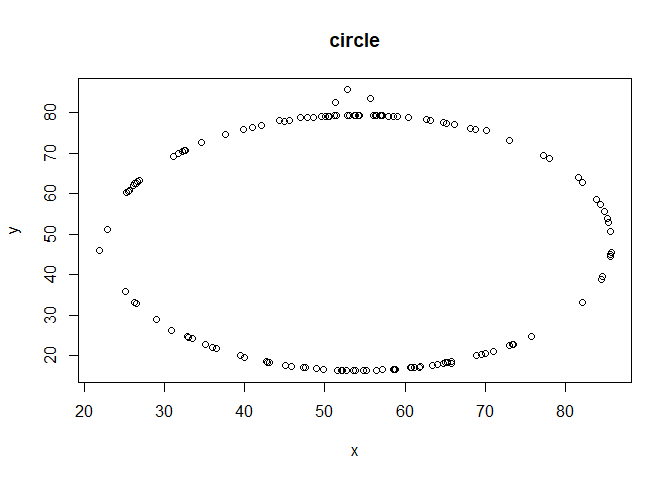<!-- -->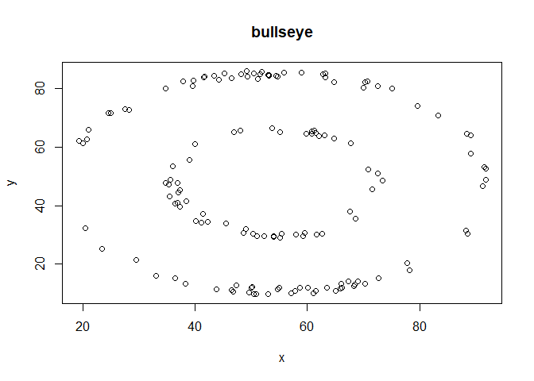<!-- --><!-- -->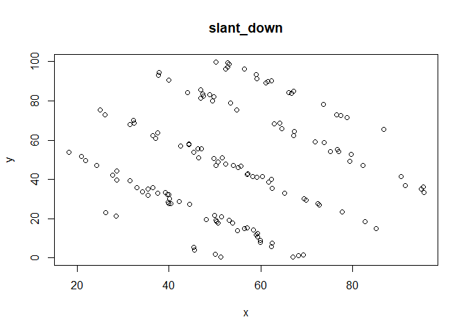<!-- -->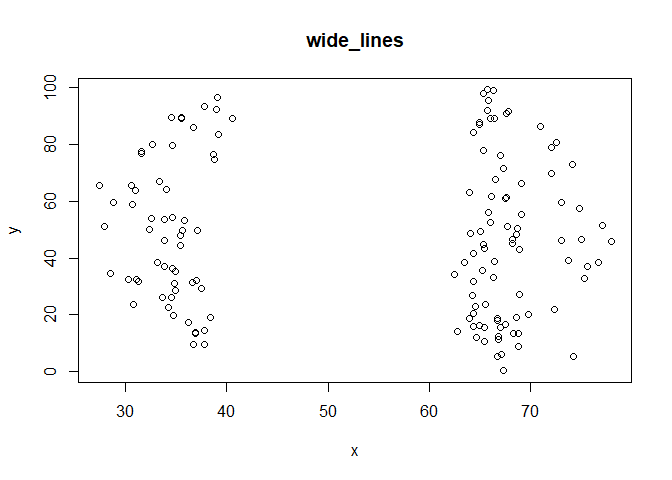<!-- -->

### See MICs

```r
all.MIC <- NULL
for(i in 1:length(dn)){
  ds <- dn[i]
  dd <- dists.df %>% filter(dataset==ds) 
  stats <- cbind(dataset=ds, mine(x = dd$x, y = dd$y) %>% data.frame)
  all.MIC <- rbind(all.MIC, stats)
}

print(all.MIC)
#>       dataset       MIC        MAS       MEV      MCN    MIC.R2      GMIC
#> 1        dino 0.2397661 0.03176621 0.2397661 2.000000 0.2356095 0.1595937
#> 2        away 0.2129060 0.04177858 0.2129060 2.584963 0.2087935 0.1054858
#> 3     h_lines 0.1836382 0.01757058 0.1836382 2.584963 0.1798295 0.1044030
#> 4     v_lines 0.1915456 0.03325806 0.1915456 2.584963 0.1867229 0.1027981
#> 5     x_shape 0.5395096 0.22764300 0.5150574 2.584963 0.5352084 0.3844604
#> 6        star 0.6456739 0.25574139 0.6456739 3.000000 0.6417098 0.4823076
#> 7  high_lines 0.3256681 0.10477156 0.3256681 3.000000 0.3209752 0.1877918
#> 8        dots 0.4550736 0.21225764 0.4550736 3.321928 0.4514325 0.2274553
#> 9      circle 0.5935291 0.05916954 0.3637452 2.584963 0.5888583 0.3225737
#> 10   bullseye 0.2694705 0.09252888 0.2593180 2.584963 0.2647664 0.1607653
#> 11   slant_up 0.2610554 0.07957347 0.2610554 2.584963 0.2563481 0.1611364
#> 12 slant_down 0.2742995 0.07658129 0.2742995 2.584963 0.2695413 0.1598864
#> 13 wide_lines 0.2207071 0.01373693 0.2207071 2.584963 0.2162749 0.1307553
#>         TIC
#> 1  3.625012
#> 2  2.671553
#> 3  2.595019
#> 4  2.692859
#> 5  8.556818
#> 6  9.596451
#> 7  3.846615
#> 8  5.492663
#> 9  9.235240
#> 10 4.100664
#> 11 3.891070
#> 12 3.984356
#> 13 3.212838
```


