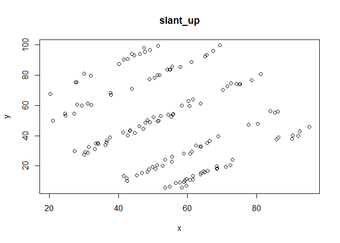

## Overview

Evalutating MIC to the Datasaurus Dozen data set using minerva package in R.
**Same Stats, Different Graphs: Generating Datasets with Varied Appearance and Identical Statistics through Simulated Annealing". [ACM SIGCHI Conference on Human Factors in Computing Systems](https://www.autodeskresearch.com/publications/samestats)**

## Examples
### Data preparation

```r
require(minerva)
require(tidyverse)
require(magrittr)

dists.df <- read.delim(file = "src/DatasaurusDozen.tsv", sep = "\t", header = TRUE)
```
### View

```r
dn <- unique((dists.df$dataset))
for(i in 1:length(dn)){
  dists.df %>% filter(dataset==dn[i]) %$% plot(x=x, y=y, main=dn[i])
}
```

<!-- --><!-- --><!-- --><!-- --><!-- --><!-- --><!-- --><!-- --><!-- --><!-- --><!-- --><!-- --><!-- -->

### See MICs

```r
all.MIC <- NULL
for(i in 1:length(dn)){
  ds <- dn[i]
  dd <- dists.df %>% filter(dataset==ds) 
  stats <- cbind(dataset=ds, mine(x = dd$x, y = dd$y) %>% data.frame)
  all.MIC <- rbind(all.MIC, stats)
}

all.MIC %>% mutate_if(is.numeric, function(x) round(x, digits=3))
#>       dataset   MIC   MAS   MEV   MCN MIC.R2  GMIC   TIC
#> 1        dino 0.240 0.032 0.240 2.000  0.236 0.160 3.625
#> 2        away 0.213 0.042 0.213 2.585  0.209 0.105 2.672
#> 3     h_lines 0.184 0.018 0.184 2.585  0.180 0.104 2.595
#> 4     v_lines 0.192 0.033 0.192 2.585  0.187 0.103 2.693
#> 5     x_shape 0.540 0.228 0.515 2.585  0.535 0.384 8.557
#> 6        star 0.646 0.256 0.646 3.000  0.642 0.482 9.596
#> 7  high_lines 0.326 0.105 0.326 3.000  0.321 0.188 3.847
#> 8        dots 0.455 0.212 0.455 3.322  0.451 0.227 5.493
#> 9      circle 0.594 0.059 0.364 2.585  0.589 0.323 9.235
#> 10   bullseye 0.269 0.093 0.259 2.585  0.265 0.161 4.101
#> 11   slant_up 0.261 0.080 0.261 2.585  0.256 0.161 3.891
#> 12 slant_down 0.274 0.077 0.274 2.585  0.270 0.160 3.984
#> 13 wide_lines 0.221 0.014 0.221 2.585  0.216 0.131 3.213
```

### Plot MICs

```r
ggplot(all.MIC, aes(x=dataset, y = MIC)) +
  geom_bar(stat = "identity") +
  xlab("") +
  coord_flip()
```

<!-- -->

